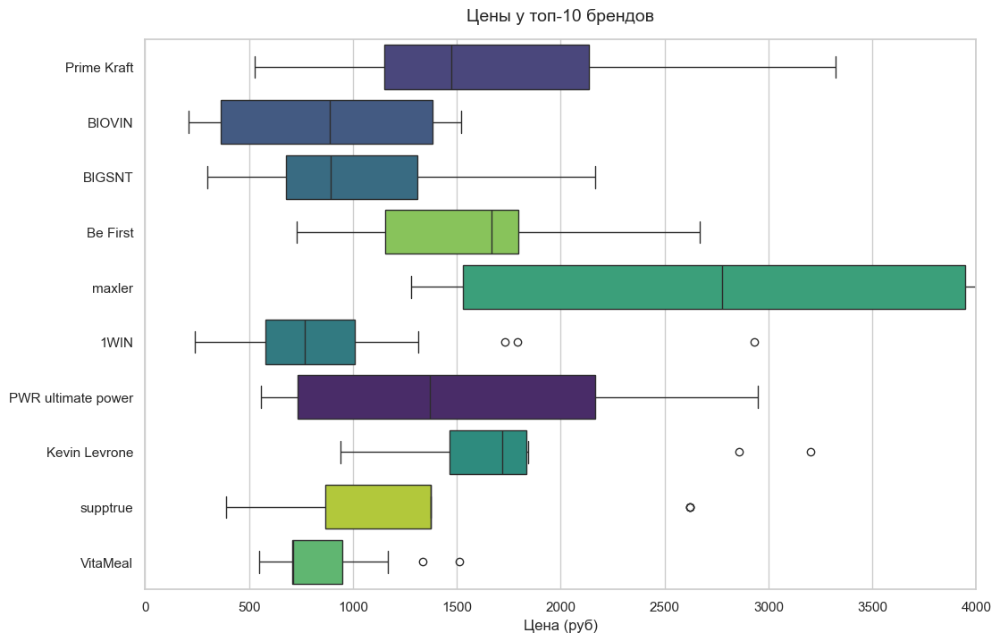
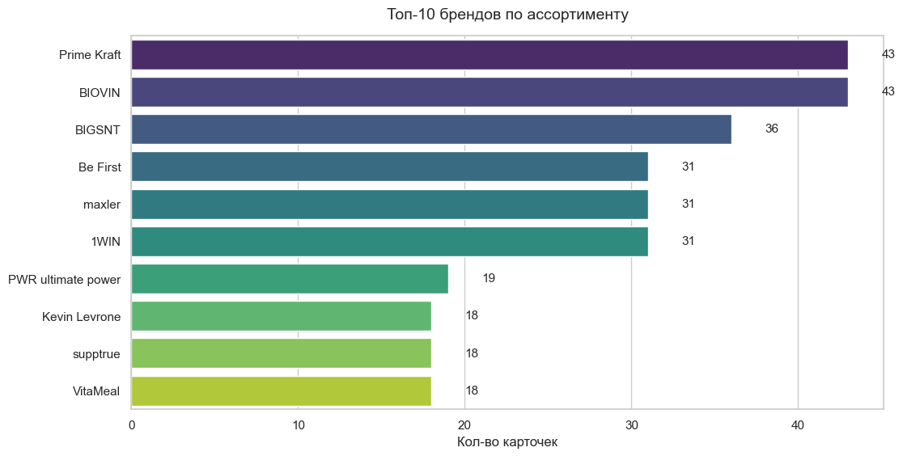

# Анализ цен на спортивное питание (Wildberries) 📊

Мой пет-проект, в котором я прошел весь путь от сбора "грязных" данных из недокументированного API до готовой реляционной базы и аналитических дашбордов. Тему выбрал не случайно: я сам занимаюсь в зале и разбираюсь в добавках, поэтому мне было интересно посмотреть на рынок со стороны данных.

## 🏆 Ключевые выводы (Exploratory Data Analysis)



Глядя на распределение цен, можно сделать несколько выводов по рынку:
* **Разброс цен:** Медианная цена на протеин ожидаемо выше остальных категорий, при этом размах "усов" на графике говорит о наличии как жесткого демпинга, так и сильной наценки за бренд. Ценник на базовые добавки вроде креатина и цитруллина держится в гораздо более узком и стабильном коридоре.



* **Монополисты выдачи:** Рынок сильно консолидирован. Несколько брендов (включая Prime Kraft и BIOVIN) занимают лидирующие позиции по количеству уникальных карточек товаров, агрессивно заполняя поисковую выдачу маркетплейса.

## 🛠 Что реализовано в проекте (ETL пайплайн):
1. **Data Scraping (Парсинг):** Написан скрипт для обхода внутреннего API Wildberries. Настроена пагинация и таймауты для обхода блокировок.
2. **Data Cleaning (Предобработка):** Обработка сырых JSON с помощью Pandas. Конвертация валют (копейки в рубли), нормализация названий брендов, обработка пропусков.
3. **Database Design (Хранение):** Спроектирована база SQLite. Данные нормализованы на две таблицы со связями (Foreign Keys), чтобы соответствовать стандартам реляционных БД.
4. **Exploratory Data Analysis:** Построены графики (Seaborn, Matplotlib) для поиска аномалий и ценовых паттернов.

## 💻 Стек технологий
* **Язык программирования:** Python
* **Сбор и обработка данных:** Requests, Pandas
* **Базы данных:** SQLite3 (SQL-запросы)
* **Визуализация:** Seaborn, Matplotlib, Jupyter Notebook

## 🚀 Как запустить проект локально

1. Склонируйте репозиторий:
```bash
git clone [https://github.com/dskoloskov/ds_supplements_pricing.git](https://github.com/dskoloskov/ds_supplements_pricing.git)
cd ds_supplements_pricing